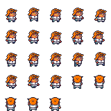
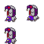
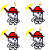
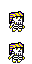
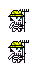
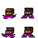
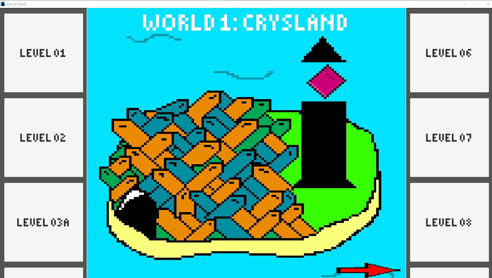
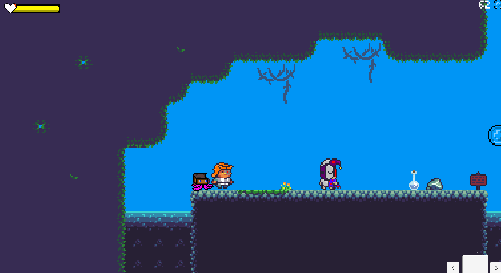
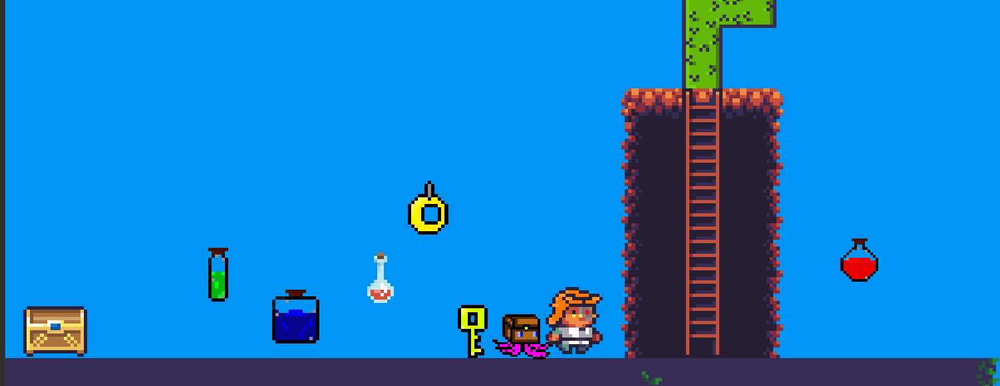

# Story of Cytrull

## développer
- tom daret

## config

dans Library\il2cpp_cache\linkresult_385EB1EC59081619191313081A9CC192 décompresser le fichier buid.bc
### dossier build
le dossier sert au lancement du jeu

### dossier assets

- dossier animation des sprites
- dossier audio 
- dossier import (tous les données importés)
- dossier palette (les palettes pour le décor)
- dossier scenes (tous les maps)
-dossier script

## définition
- 2D pixel
- jeu platforme

## personnage

### joueur
 - cytrull  
 

### pnj
- deadly dice  

- vendeur  

## items
- potion de soin
- potion de saut
- potion de vitesse (2 niveau)
- anneau invincibilité
- etc 

## familier
- poulpo  

- etc

## image

